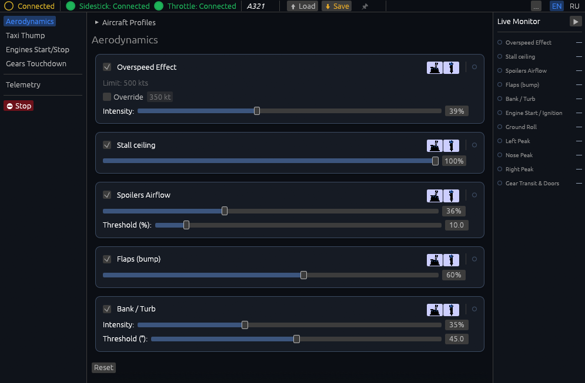

<div align="center">


# ✈️ Aurora Vibra
### Advanced Flight Simulator Tactile & FFB Hub

[](LICENSE)
[]()
[]()

*Next-generation tactile feedback (force feedback / rumble) and telemetry utility for Microsoft Flight Simulator (MSFS).*

</div>

---

## 🌟 Overview

An advanced control hub for tactile feedback and physical response designed for flight sticks, yokes, and throttles (including the WinWing ecosystem). This utility overcomes default software limitations and delivers an immersive, realistic feel for both heavy jetliners and general aviation aircraft.



Effect groups sit on the left, per-effect intensity and thresholds in the middle, and live telemetry on the right. Every effect can be routed to the sidestick, the throttle, or both.

---

## 📥 Download & Install

1. Grab the latest `aurora-vibra-vX.Y.Z-windows-x64.zip` from the
   [**Releases**](https://github.com/chegevarko1982/aurora-vibra/releases/latest) page.
2. *(Recommended)* Verify the download against the `SHA256SUMS.txt` published with it:

   ```powershell
   Get-FileHash -Algorithm SHA256 .\aurora-vibra-vX.Y.Z-windows-x64.zip
   ```

3. Unzip it into a folder **you can write to** — e.g. `%LOCALAPPDATA%\Aurora Vibra`
   or anywhere under `Documents`. The app stores its settings and log next to the
   executable when possible, and falls back to `%LOCALAPPDATA%\AuroraVibra` otherwise.
   Avoid `C:\Program Files`: the built-in updater would then need an
   administrator prompt on every update.
4. Run `Aurora Vibra.exe`. No installer, no registry entries, no admin rights required.

There is nothing else to install — the SimConnect client library is carried inside
the executable as a fallback (see [the licensing note](#-license) below), so the app
works even on machines where MSFS 2024 is the only simulator present.

> **SmartScreen warning.** The executable is not code-signed, so Windows may show
> "Windows protected your PC" on first launch — choose **More info → Run anyway**.
> If you would rather not take that on trust, verify the checksum in step 2 or
> build from source (below).

### First run

- Start MSFS, then Aurora Vibra (either order works — it reconnects on its own).
- The top bar shows the SimConnect link status plus two dots for the Sidestick and
  the Throttle, which light up once each device is detected.
- If something does not connect, `AuroraVibra.log` (next to the .exe, or in
  `%LOCALAPPDATA%\AuroraVibra`) records every path that was tried.

### Updating

**Options → Check for updates** in the toolbar, or the same entry in the tray menu.
The updater verifies the downloaded archive against the release's published SHA-256
before installing anything, and refuses to proceed if it does not match.

---

## 🚀 Key Features & Advantages

### 1. 🧩 Native Support for Complex High-Fidelity Add-ons (PMDG, MADDOG X, TFDi)
- **Overcoming vendor limitations:** dedicated telemetry handling for complex study-level add-ons (**PMDG 737 / 777**, **Leonardo MADDOG X**, **TFDi MD-11**) where standard vendor tools either lack support or suffer from telemetry desync.
- **Lag-free sync:** direct reading of custom internal variables (L:Vars and SDK data areas) keeps physical vibration, cockpit instruments, and sound modules in sync.

### 2. 🛬 Progressive Runway & Taxi Physics (Taxi & Takeoff Thump)
- **Seamless speed blending:** an advanced mathematical model smoothly transitions individual runway-joint thumps during taxi into a continuous, dense rumble as the aircraft accelerates down the runway.
- **Independent gear struts:** individual load and compression processing for nose and main landing gear — a distinct tactile sense of main-gear touchdown followed by the nose gear lowering onto the centerline.

### 3. 🎛️ Multi-Device Routing & Asymmetric Throttle "Ping-Pong"
- **Flexible channel addressing:** route any tactile effect (gear thumps, engine rumble, flap actuation) independently to the flight stick, the throttle unit, or both.
- **Hydraulic mechanics simulation:** alternating vibration logic between throttle motors, mimicking the tactile feel of hydraulic pumps and electric actuators.

### 4. 🔥 Detailed Engine Start & Turbine Telemetry
- **Spool-up tracking (N2):** monitors real high-pressure spool (N2) acceleration from 0% through starter cutout, dynamically shaping vibration at fuel ignition.
- **Multi-engine support:** tailored profiles for jet and piston powerplants, up to 4 engines.

### 5. 🌊 True Control-Surface Animation Tracking
- **Physical surface movement:** flap and slat vibration is tied to actual aerodynamic surface displacement, not the cockpit switch position.
- **Flight-envelope dynamics:** progressive pulsation during steep turns, stall buffet, and overspeed.

### 6. 🤖 Automation & Profile Management
- **Automatic aircraft detection:** reads SimConnect variables in real time to identify the aircraft and apply the right tactile preset.
- **Modern GUI (egui):** lightweight, responsive interface with fine-grained sliders, per-aircraft profiles, and an English/Russian language switch.

---

## 🛠️ System Requirements & Building

- **OS:** Windows 10 / 11
- **Simulator:** Microsoft Flight Simulator (MSFS 2020 / 2024) via SimConnect
- **Supported hardware:** FFB & vibration-capable flight controls (WinWing joystick & throttle, etc.)

To build from source (requires the **Rust** toolchain, 1.88 or newer):

```bash
cargo build --release --bin aurora-vibra --features app
```

The build embeds a copy of `SimConnect.dll` and extracts it at runtime as a last-resort fallback, so the binary works even where no SimConnect client library is installed — see [THIRD-PARTY-NOTICES.md](THIRD-PARTY-NOTICES.md) for the licensing status of that file.

The `src/bin/` directory holds manual diagnostic benches (motor sweeps, HID frame
captures, SimConnect probes). They are gated behind a separate feature so ordinary
builds stay lean:

```bash
cargo run --features dev-tools --bin test_motor_gui
```

---

## 📌 Acknowledgments

Special thanks to [Rodrigo Troncoso](https://github.com/rtroncoso) for creating the original base repository ([ursa-minor-ffb](https://github.com/rtroncoso/ursa-minor-ffb)), its foundational architecture, and the open-source codebase that made this extended and enhanced utility possible.

Aurora Vibra is a **fork** of [ursa-minor-ffb](https://github.com/rtroncoso/ursa-minor-ffb), used under the MIT License. Portions of this software are Copyright (c) 2025 Rodrigo Troncoso.

## ☕ Support the Project

We'd be happy to receive your donation towards the project's development — adding new features and adapting support for custom aircraft models:

**BTC:** `bc1p5txluxsen8uqhy0k3j0v9s6afemt5zkyftzjv4asc5uh3lw44u7snkplr5`

**YooMoney:** [410011348629282](https://yoomoney.ru/to/410011348629282)

## 📜 License

Distributed under the [MIT License](LICENSE), which covers the Aurora Vibra source code and the upstream code it derives from.

It does **not** cover third-party components. In particular, released binaries embed Microsoft's proprietary `SimConnect.dll` as a fallback for machines where no SimConnect client library is present; that file is governed by the [MSFS SDK EULA](https://docs.flightsimulator.com/msfs2024/html/1_Introduction/SDK_EULA.htm), not by this project's license. See [THIRD-PARTY-NOTICES.md](THIRD-PARTY-NOTICES.md) for the full statement, including how to build without it.
